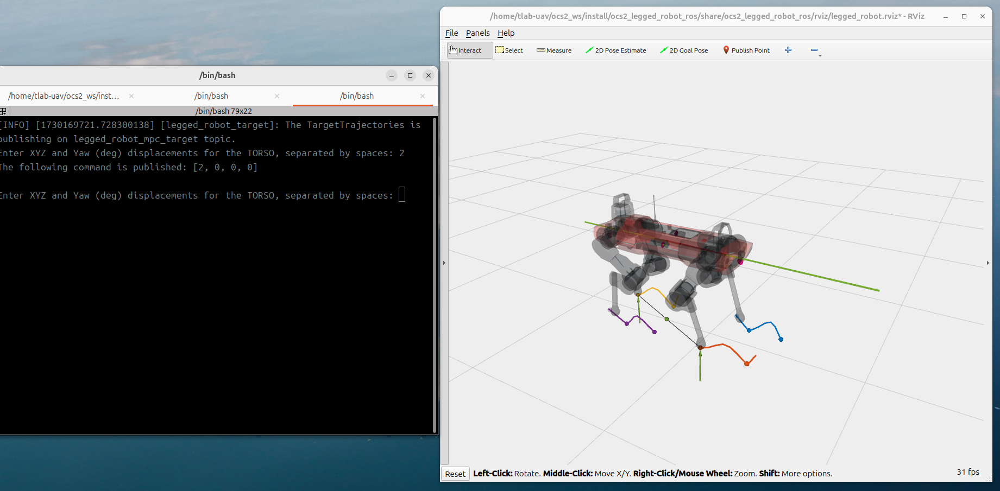

# OCS2_ROS2 Toolbox

## 1. Summary

OCS2_ROS2 is developed based on [OCS2](https://github.com/leggedrobotics/ocs2), it was refactored to be compatible with
ROS2 and modern cmake. Below is the current todolist of the project:

- [x] modern cmake
- [x] basic 6 examples in official documents
- [x] WSL2 support
- [x] Fix Quadrotor example's unexpected behavior
- [x] Fix Mobile Manipolator's interactive marker
- [x] perceptive locomotion demo
- [x] tinyxml2 problem in Ubuntu 24.04 ROS2 Jazzy
- [x] raisim demo
- [x] mpc_net demo
- [x] **[2025-01-16]** Pinnochio 3 support, removed hpp-fcl dependency

The IDE I used is CLion, you can follow the [guide](https://www.jetbrains.com/help/clion/ros2-tutorial.html) to set up
the IDE.

Below is my tested platform:
* Intel Nuc X15 (i7-11800H):
    * Ubuntu 22.04 ROS2 Humble (WSL2)
    * Ubuntu 24.04 ROS2 Jazzy
* Lenovo P16v (i7-13800H):
    * Ubuntu 24.04 ROS2 Jazzy
* Jetson Orin Nano
    * Ubuntu 22.04 ROS2 Humble (JetPack 6.1)


## 2. Installation

### 2.1 Prerequisites

The OCS2 library is written in C++17. It is tested under Ubuntu with library versions as provided in the package
sources.

Tested system and ROS2 version:

* Ubuntu 24.04 ROS2 Jazzy
* Ubuntu 22.04 ROS2 Humble

### 2.2 Dependencies

* C++ compiler with C++17 support
* Eigen (v3.4)
* Boost C++ (v1.74)
* [Pinocchio](https://stack-of-tasks.github.io/pinocchio/download.html)
> **Warm Reminder**: Please follow the guide in the link to install Pinocchio before building the project

### 2.3 Clone Repositories

* Create a new workspace or clone the project to your workspace

```bash
cd ~
mkdir -p ocs2_ws/src
```

* Clone the repository

```bash
cd ~/ocs2_ws/src
git clone https://github.com/legubiao/ocs2_ros2
git submodule update --init --recursive
```

* rosdep

```bash
cd ~/ocs2_ws
rosdep install --from-paths src --ignore-src -r -y
```

### 2.4 [Basic Examples](basic%20examples/)

Quick start guide:

* Compile legged robot example
    ```bash
    cd ~/ocs2_ws
    colcon build --packages-up-to ocs2_legged_robot_ros
    ```
* Run the legged robot example
    ```bash
    source ~/ocs2_ws/install/setup.bash
    ros2 launch ocs2_legged_robot_ros legged_robot_ddp.launch.py
    ```



[](https://www.bilibili.com/video/BV12vv9eGEns/)

## 3. Advanced Examples

[](https://www.bilibili.com/video/BV1gSHLe3EEv/)

### 3.1 [Perceptive Locomotion](advance%20examples/ocs2_raisim/)


### 3.2 [RaiSim Simulation](advance%20examples/ocs2_raisim/)


### 3.3 [MPC-Net](advance%20examples/ocs2_mpcnet/)