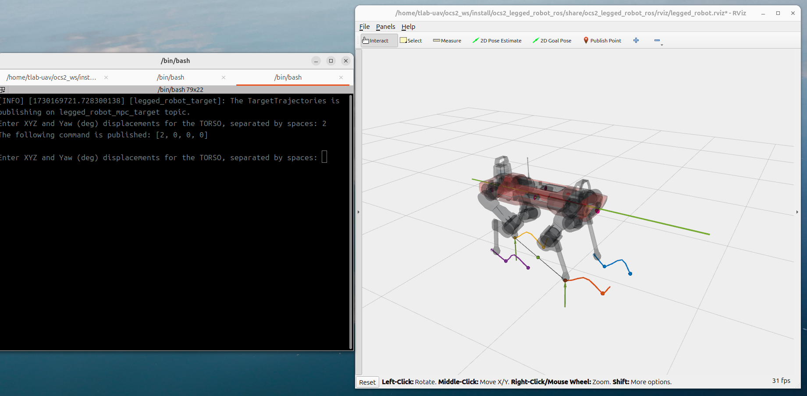
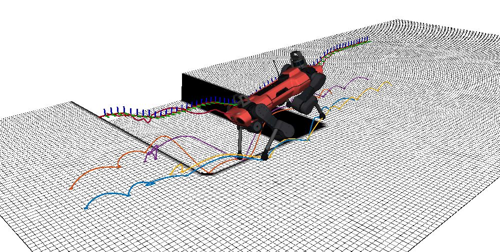
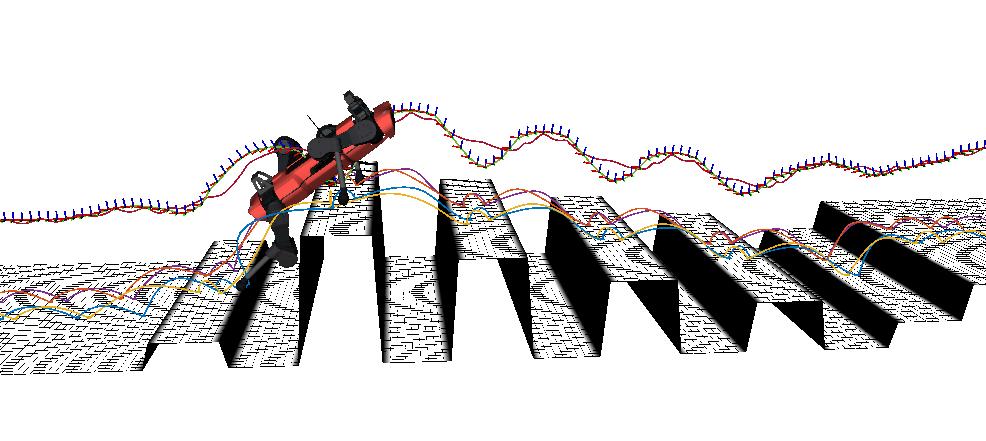
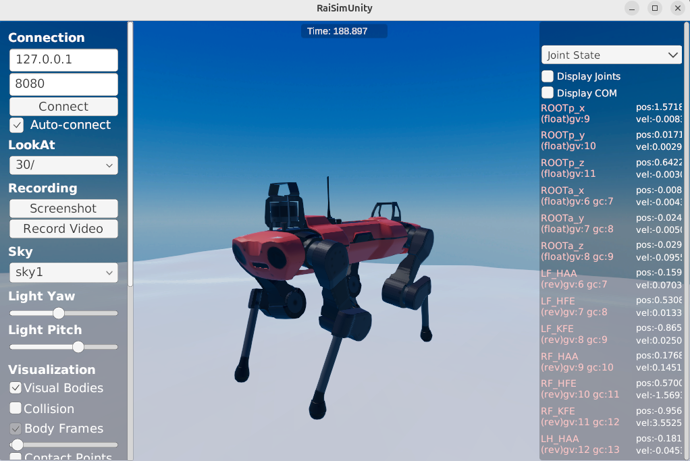
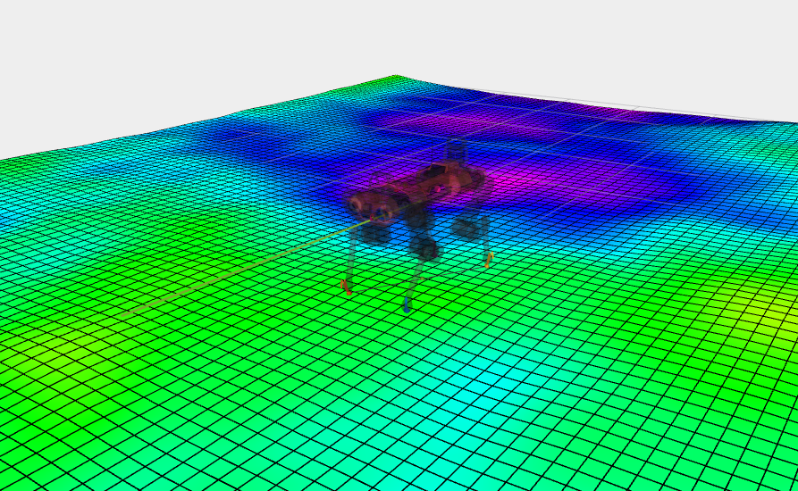

# OCS2_ROS2 Toolbox

## 1. Summary

OCS2_ROS2 is developed based on [OCS2](https://github.com/leggedrobotics/ocs2), it was refactored to be compatible with ROS2 and modern cmake.

### What's New (2025.08)

**Pinocchio 3 Dependency Optimization**
- Upgraded to Pinocchio 3 version for better performance and stability
- Support for installing Pinocchio from ROS sources, avoiding complex third-party package management

**Dual-Arm Mobile Manipulator Support**
- Added Dual-Arm Mobile Manipulator functionality
- Enhanced interactive markers for better user operation experience

The IDE I used is CLion, you can follow the [guide](https://www.jetbrains.com/help/clion/ros2-tutorial.html) to set up
the IDE.

### Tested Platform

* Intel Nuc X15 (i7-11800H):
    * Ubuntu 22.04 ROS2 Humble  (WSL2 included)
    * Ubuntu 24.04 ROS2 Jazzy   (WSL2 included)
* Lenovo P16v (i7-13800H):
    * Ubuntu 24.04 ROS2 Jazzy
* Jetson Orin Nano
    * Ubuntu 22.04 ROS2 Humble (JetPack 6.1)

## 2. Installation

### 2.1 Prerequisites

The OCS2 library is written in C++17. It is tested under Ubuntu with library versions as provided in the package
sources.

Tested system and ROS2 version:

* Ubuntu 24.04 ROS2 Jazzy
* Ubuntu 22.04 ROS2 Humble

### 2.2 Dependencies

* C++ compiler with C++17 support
* Eigen (v3.4)
* Boost C++ (v1.74)

> **Note:** Latest version used pinocchio from ros source to simplified install steps. If you install pinocchio from robot-pkgs, you can uninstall it by
> ```bash
> sudo apt remove robotpkg-*
> ```

### 2.3 Clone Repositories

* Create a new workspace or clone the project to your workspace

```bash
cd ~
mkdir -p ros2_ws/src
```

* Clone the repository

```bash
cd ~/ros2_ws/src
git clone https://github.com/legubiao/ocs2_ros2
cd ocs2_ros2
git submodule update --init --recursive
```

* rosdep

```bash
cd ~/ros2_ws
rosdep install --from-paths src --ignore-src -r -y
```

### 2.4 [Basic Examples](basic%20examples/)

Quick start guide:

* Compile legged robot example
    ```bash
    cd ~/ros2_ws
    colcon build --packages-up-to ocs2_legged_robot_ros --symlink-install
    ```
* Run the legged robot example
    ```bash
    source ~/ros2_ws/install/setup.bash
    ros2 launch ocs2_legged_robot_ros legged_robot_ddp.launch.py
    ```



[](https://www.bilibili.com/video/BV12vv9eGEns/)

## 3. Advanced Examples

[](https://www.bilibili.com/video/BV1gSHLe3EEv/)

### 3.1 [Perceptive Locomotion](advance%20examples/ocs2_perceptive_anymal/)





### 3.2 [RaiSim Simulation](advance%20examples/ocs2_raisim/)





### 3.3 [MPC-Net](advance%20examples/ocs2_mpcnet/)
