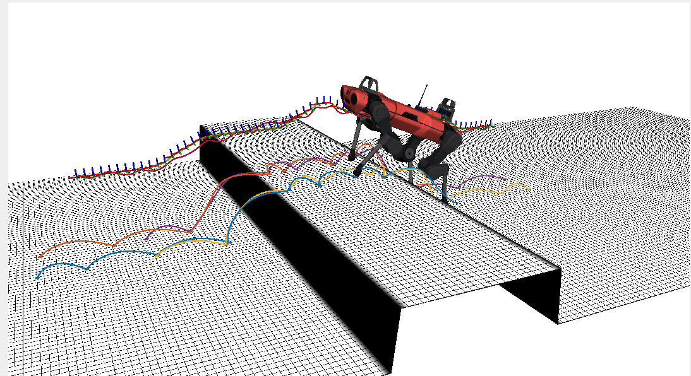
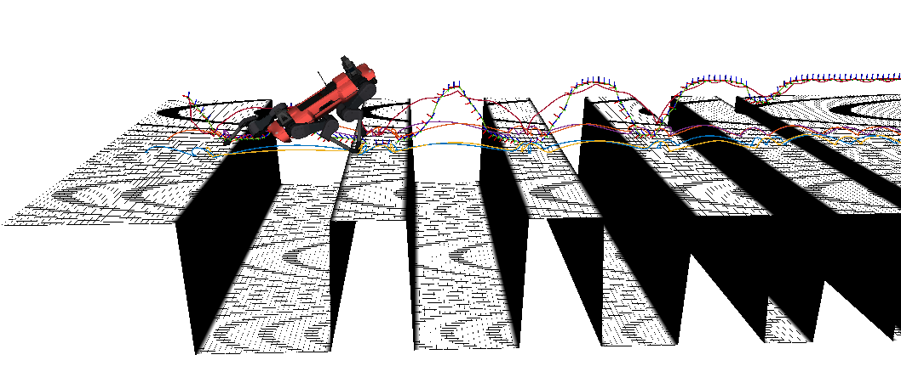

# OCS2 Anymal Loopshaping MPC

This package provided a perceptive mpc demo to allow Anymal_c robot to cross different terrains.

## 1. Build the package

```bash
cd ~/ocs2_ws/
colcon build --packages-up-to ocs2_anymal_loopshaping_mpc 
```

## 2. Perceptive MPC demo

In this launch file, you can tried different terrains.

### 2.1 basic step

```bash
source ~/ocs2_ws/install/setup.bash
ros2 launch ocs2_anymal_loopshaping_mpc perceptive_mpc_demo.launch.py
```



### 2.2 side gap

```bash
source ~/ocs2_ws/install/setup.bash
ros2 launch ocs2_anymal_loopshaping_mpc perceptive_mpc_demo.launch.py terrain_name:=side_gap.png
```


### 2.3 gaps

```bash
source ~/ocs2_ws/install/setup.bash
ros2 launch ocs2_anymal_loopshaping_mpc perceptive_mpc_demo.launch.py terrain_name:=gaps.png terrain_scale:=1.0 forward_distance:=7.0
```



### 2.4 hurdles

```bash
source ~/ocs2_ws/install/setup.bash
ros2 launch ocs2_anymal_loopshaping_mpc perceptive_mpc_demo.launch.py terrain_name:=hurdles.png terrain_scale:=0.7 forward_distance:=7.0
```


### 2.5 stepping stones

```bash
source ~/ocs2_ws/install/setup.bash
ros2 launch ocs2_anymal_loopshaping_mpc perceptive_mpc_demo.launch.py terrain_name:=stepping_stones.png terrain_scale:=1.0 forward_distance:=7.0
```

