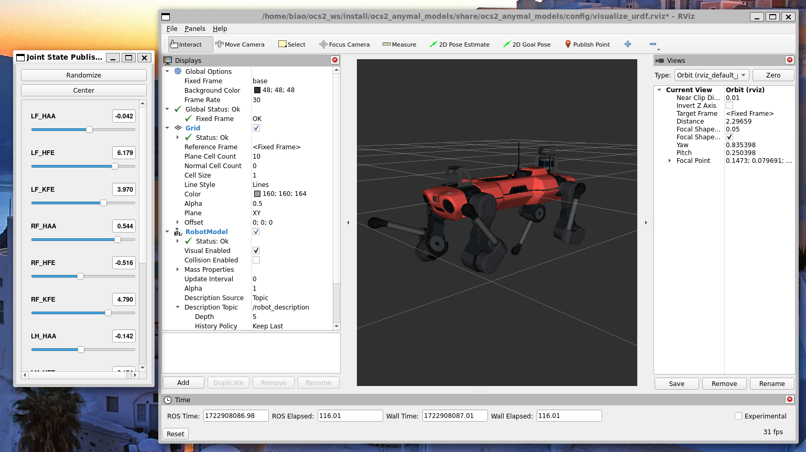

# OCS2 Anymal Models

Since the [anymal_c package](https://github.com/ANYbotics/anymal_c_simple_description) doesn't have ros2 version yet, please don't used the "camel" option.

This package provide a visualization of the quadruped robot, in the rviz you can adjust the parameter and check robot configuration.



* build command
```bash
colcon build --packages-up-to ocs2_anymal_models --cmake-args -DCMAKE_EXPORT_COMPILE_COMMANDS=ON -DCMAKE_BUILD_TYPE=RelWithDebInfo
```

* launch command
```bash
ros2 launch ocs2_anymal_models visualize.launch.py
```