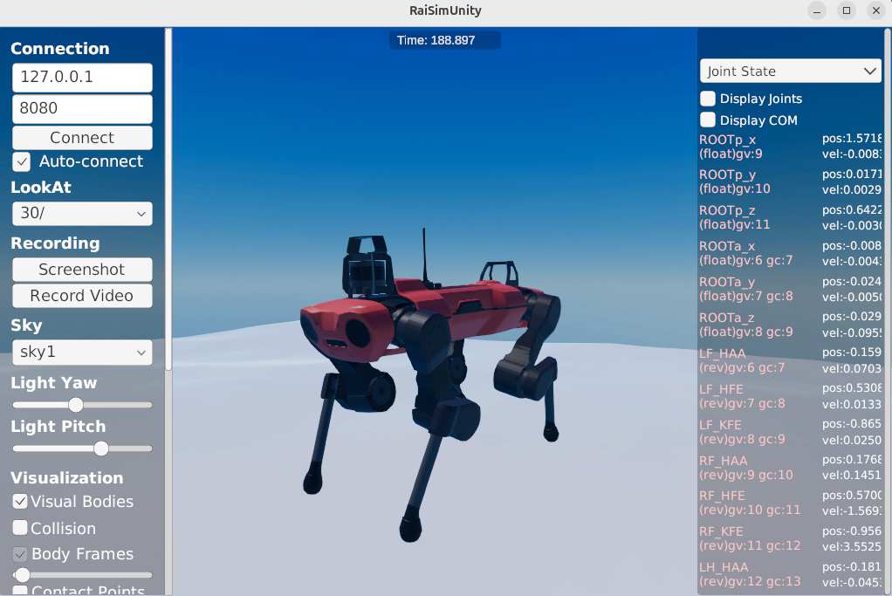
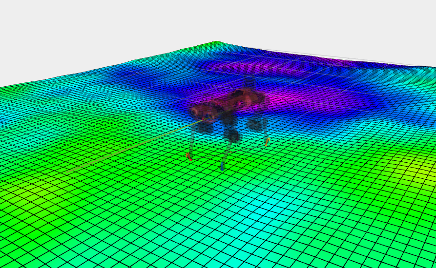

# OCS2 Anymal RaiSim Simulation

This directory contains an example of an OCS2 simulation of the Anymal robot in the RaiSim physics engine.  

Raisim provided education license for free, you can apply it from [here](https://www.raisim.com/education). After you get the license, you can follow the instructions to install the RaiSim and RaiSimUnity.






* build the package

## build and run this demo
In the CmakeList.txt, I set the installation path for RaisimLib, please change it to your own path.

```cmake
set(CMAKE_PREFIX_PATH "~/raisimLib/raisim/linux" ${CMAKE_PREFIX_PATH})
```

* build the package
```bash
cd ~/ocs2_ws
colcon build --packages-up-to ocs2_legged_robot_raisim
```

* launch the simulation
```bash
source ~/ocs2_ws/install/setup.bash
ros2 launch ocs2_legged_robot_raisim legged_robot_ddp_raisim.launch.py 
```