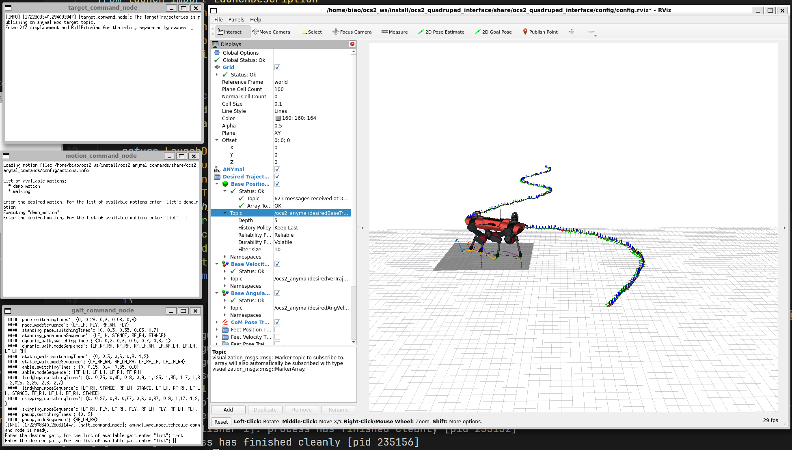

# OCS2 Anymal MPC

This package provide a mpc example for Anymal quadruped robot. Besides the basic movement like ocs2_legged_robot_ros, this example provided "demo_motion" example.



* build command
```bash
colcon build --packages-up-to ocs2_anymal_mpc --cmake-args -DCMAKE_EXPORT_COMPILE_COMMANDS=ON -DCMAKE_BUILD_TYPE=RelWithDebInfo
```

* launch command
```bash
ros2 launch ocs2_anymal_mpc anymal_c.launch.py
```